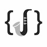

# Jazz

Jazz is a minimalistic template engine with zero runtime dependency.

## Installation

    npm install jazz

## Usage

    var jazz = require("jazz");
    var sys = require("sys");
    
    var template = jazz.compile("my template source code {someVariable}");
    template.eval({"someVariable": "lolmuffin"}, function(data) { sys.puts(data); });

This example would output the following:

    my template source code lolmuffin

### Printing variables

    {someVariable}

This works for any type of expression, so the following should also work:

    {users.fred}
    {"hello"}
    {45}
    {a eq b}

### Filter functions

You can call filter functions like so:

    {someFilter(arg1, arg2)}

Filter functions are statements, NOT expressions so they cannot be chained
nor used in if/forelse/etc. tests. However, calls can be made on any type
of expression -- e.g.

    {math.sin(45)}

### Implementing filter functions

Filter functions may block so rather than returning the value you want
rendered as you might in other frameworks, jazz passes in a callback to
your filter function that you then call to indicate that you have a
result. e.g. here we simulate a blocking operation using setTimeout().

    // sum.jazz

    {sum(5, 10)}

    // sum.js

    var jazz = require("jazz");

    var params = {
        sum: function(arg1, arg2, cb) {
            setTimeout(function() {
                cb((arg1 + arg2).toString());
            }, 2000);
        }
    }
    jazz.compile("sum.jazz").eval(params, function(output) { console.log(output); });

Note that even though the execution of the callback is delayed, this example still
works.

### Conditional Statements

You can check if a variable evaluates to a true value like so:

    {if name}
        Hello, {name}
    {end}

Else clauses are also supported:

    {if name}
        Hello, {name}
    {else}
        Hello, Captain Anonymous
    {end}

As are else..if clauses:

    {if firstName}
        Hello, {firstName}
    {elif lastName}
        Hello, Mr. {lastName}
    {else}
        Hello, Captain Anonymous
    {end}

Limited logical expressions are also possible:

    {if user.lastName and user.isVip}
        Hello, Mr. {user.lastName}, my good man!
    {end}

    {if fred.tired or fred.bored}
        Fred: "Yawn!"
    {end}

    {if not awake}
        Zzz
    {end}

eq & neq comparison operators are available for comparing two values:

    {if config.feature eq "enabled"}
        Feature is enabled!
    {end}

    {if status neq "inactive"}
        Huzzah!
    {end}

You can also group expressions using parentheses:

    {if (a and b) or c}
        ...
    {end}

### Looping over an array

    {foreach item in someArray}
        
{item}

    {end}

The value being iterated over can be any expression supporting
an Array-like interface.

### Looping over an object

    {foreach pair in someObject}
        
{pair.key} = {pair.value}

    {end}
    
### Synchronous functions

    {if @blah('a')}
        
There were so many blahs in a

    {end}

The function is provided to the template the same way asynchronous functions are, just with a return instead of a cb.

### Loop counters / index

    {foreach pair in someObject}
        
Loop number (1 based): {__count}

        
Index (0 based): {__index}

        
{pair.key} = {pair.value}

    {end}
    
### Looking into arrays/objects

        
{object['array'][0].cheese}

## Colophon

[Developer's Guide](https://cliffano.github.io/developers_guide.html#nodejs)

Build reports:

* [Code complexity report](https://cliffano.github.io/jazz/complexity/plato/index.html)
* [Unit tests report](https://cliffano.github.io/jazz/test/mocha.txt)
* [Test coverage report](https://cliffano.github.io/jazz/coverage/c8/index.html)
* [Integration tests report](https://cliffano.github.io/jazz/test-integration/cmdt.txt)
* [API Documentation](https://cliffano.github.io/jazz/doc/jsdoc/index.html)
